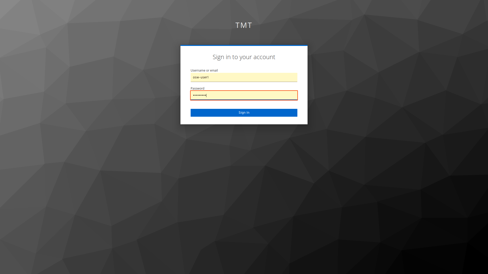
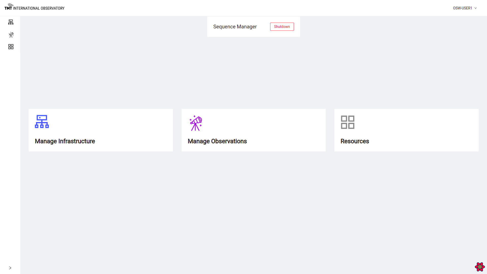

# Login and Home Page

To use OCS-ENG-UI the user must log in to the system. The user interface is integrated with the CSW Authentication and
Authorization Service, which keeps track of users and their security roles in the system.

## Logging In

The below image shows a snapshot of the login screen :

To access the Engineering UI portal in this release version, a user should log in with roles and credentials as specified below.

### Authentication and Authorization

OCS-ENG-UI is a proper UISTD user interface and requires the user be authenticated with the CSW Authentication and Authorization Service (AAS).

For testing purposes, we have created `osw-user1, esw-user1 & tcs-user1` users while launching the AAS from csw-services.

For testing purposes, user-role `osw-user1` can be used.

    Username: osw-user1         Password: osw-user1

For authorized commands, the esw-user role is required.

    Username: esw-user1         Password: esw-user1

@@@note
You may add new users to AAS/KeyCloak following procedures in the CSW documentation.  To operate OCS-ENG-UI properly the user must
have the osw-user or esw-user roles.
@@@

## Home Page

Once log in happens successfully, the user should be able to see the screen below:

### Spawn/Shutdown the Sequence Manager

The top of this page shows a button to Spawn/Shutdown the Sequence Manager. Spawning means to startup the Sequence Manager.

If Sequence Manager is been spawned with agents (as with esw-services), then it shows the label 'Shutdown' for the Sequence Manager.

@@@ note
Sequence Manager may be started without the OCS-ENG-UI from its application, and the system will still work.
@@@

Clicking on 'Shutdown' button asks for confirmation before shutting down the Sequence Manager.

Once Sequence Manager is shutdown, the label changes to 'Spawn' and a message of successful shutdown is displayed.

After clicking on 'Spawn' button, select an Agent to run Sequence Manager on.

Clicking on one of the Agents, spawns Sequence Manager on that machine.

### Home Page also shows tabs for links to

* @ref[Manage Infrastructure](./ManageInfrastructure.md)
* @ref[Manage Observations](./ManageObservation.md)
* @ref[Resources](./Resources.md)
