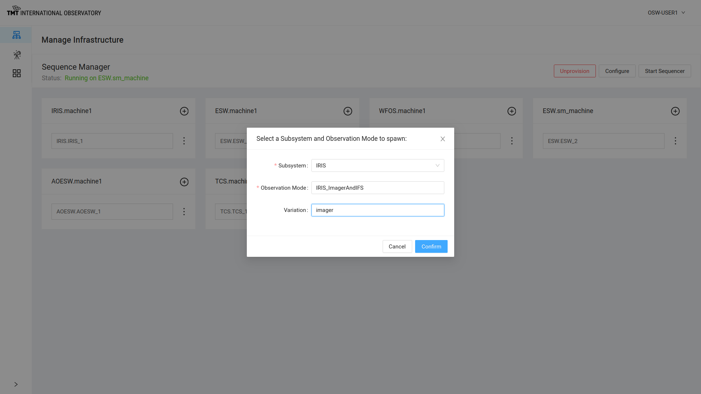
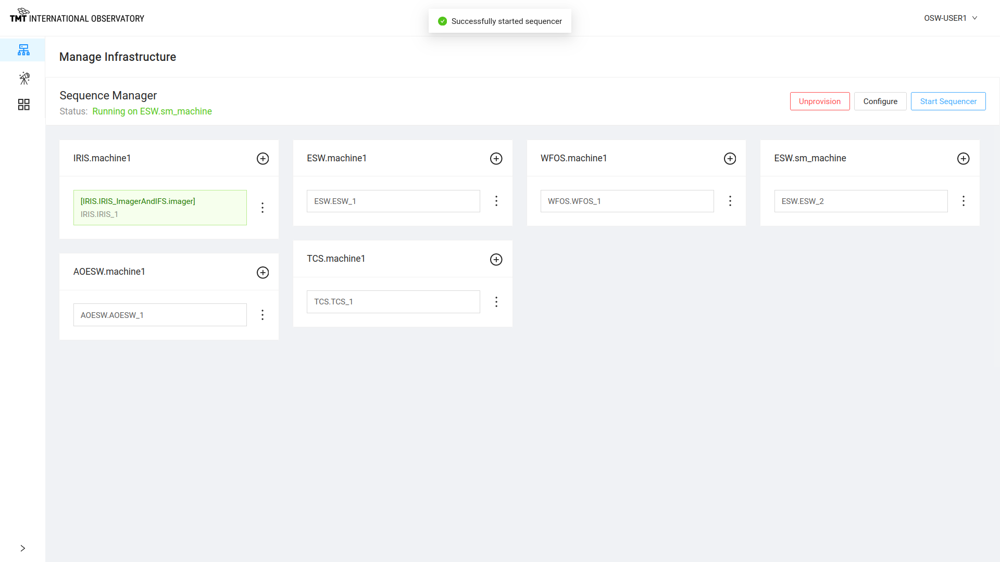
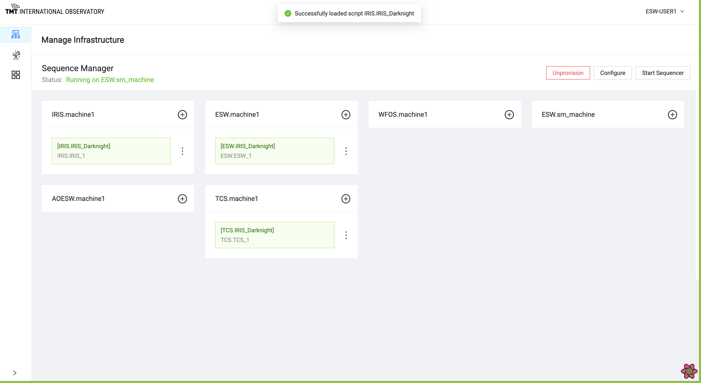
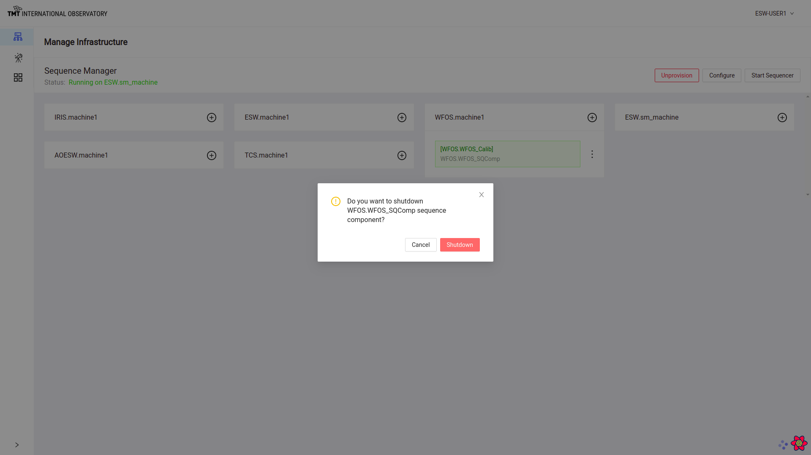

# Manage Infrastructure Page

The Manage Infrastructure Page is used to set up, and monitor the set of Sequence Components and Sequencers needed for
executing observations.  This page is primarily exercising the functionality of the Sequence Manager, so it must be
running.

This screenshot below shows the status of Sequence Manager in the upper left of the screen.
It displays information that Sequence Manager is running properly on a machine called ESW.sm_machine.

Below in the grey area, it shows in blocks or *cards*, Agents on every machine that will host Sequence Components and Sequencers and HCD/Assembly components on respective subsystem machines.

It is possible to add a single Sequence Component to any machine. To add a Sequence Component to an Agent box, click on + sign on that Agent block.

## Provisioning

Provisioning is normally done once at the start of a session. The goal is to start up as many Sequence Components as needed for the observing session.
The default values in the provision popup can be used in most development or engineering situations.

The Provision button on this page, when selected, displays the dialog box below where the user can enter the number of Sequence Components per Agent to be spawned for each particular Agent.

While provisioning, the API shuts down currently running Sequence Components before spawning new ones. You can only have one set of provisioned Sequence Components.

@@@ note

To know more about Provision functionality @extref[Visit Here](esw:technical/sequence-manager-tech.html#provision-sequence-components)

@@@

Once provisioning happens successfully, a message is displayed or else an error is displayed near the top of the screen.  The error messages can disappear quickly, so read fast!

## Unprovision

Unprovisioning is the reverse of provisioning.
Once the Agents are provisioned with Sequence Components, the label on the provision button changes to `Unprovision`.
Once Unprovision is completed, all Sequence Components are shut down and the Agents no longer show any Sequence Components.

Unprovision can also be done after 'Configure', in which case Sequencers are also shut down.

Click on `Unprovision` button to stop all Sequence Components.

Unprovision happens successfully and all Sequence Components are shutdown.

## Start Sequencer

When the Provision call is completed, it is possible to start Sequencers, and the Start Sequencer button is enabled.

Click on Start Sequencer Button to see the following dialog box.

Select a Subsystem, ObsMode to start the Sequencer.

Optional parameter Variation can be used to differentiate between any two sequencers of one subsystem(eg. IRIS).

After selecting Subsystem, ObsMode and optional Variation, the Sequencer will be started with the proper Script.
In the following example, a Sequencer has been started for the IRIS_ImagerAndIFS obsMode on IRIS.machine1 with a variation as IRIS_Imager.

Click : (three vertical dots!) on the Agent card with any of the started Sequencer to see some available options as shown in the example below:

1. Stop Sequencer
2. Reload Script
3. Shutdown Sequencer

### Stop Sequencer

Click on Stop Sequencer choice to stop a particular Sequencer and Sequence Component.

Note that there is no longer a Sequence Component running.  This is a low-level command and is not normally needed.

### Reload Script

Click on Reload Script to load a Script for the Sequencer.

This action shuts down the Sequencer and starts it again by reloading the Script. All Script state will be lost.

### Shutdown Sequencer

Click on Shutdown Component and a confirmation dialog box comes up.

This action shuts down the Sequencer and Sequence Component.

## Configure

Configure is the *normal* way of setting up all of the Sequencers for an obsMode.  Configure works from the obsMode to determine which resources and Sequencers are needed
to execute Sequences for a specific obsMode.

When the observing system has been provisioned successfully, the Configure button is enabled in Manage Infrastructure and @ref[Manage Observation](ManageObservation.md) page.

On clicking the Configure button, a list of the possible Observing Modes are displayed. The user can select one of them and the Sequence Manager will start all the needed
Sequencers and load the required Scripts.

@@@ note

To know more about Configure functionality @extref[visit here](esw:technical/sequence-manager-tech.html#configuring-sequencers-for-an-observing-mode).

@@@

The figure below shows that the Sequence Components were configured successfully and Sequencers started.

This screenshot shows that the IRIS_ImagerAndIFS obsMode was started with Sequencers for IRIS, and ESW with variation as `IRIS_Imager` and `IRIS_Ifs`. The card shows what machine each Sequencer is running on and what Script is running in the Sequencer.

Configure can also be done from @ref[Manage Observation Page](ManageObservation.md)
