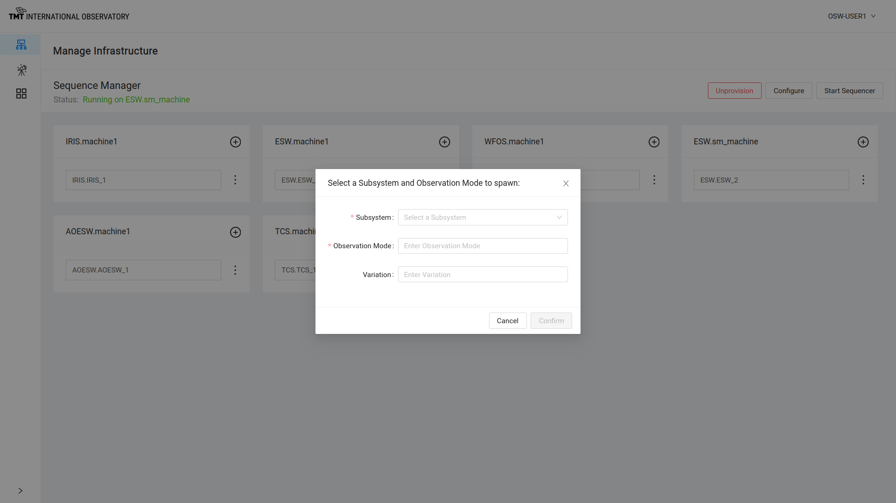
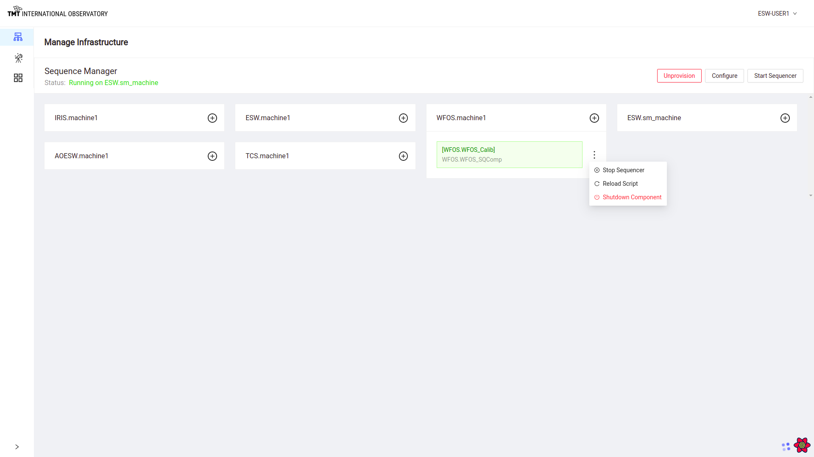
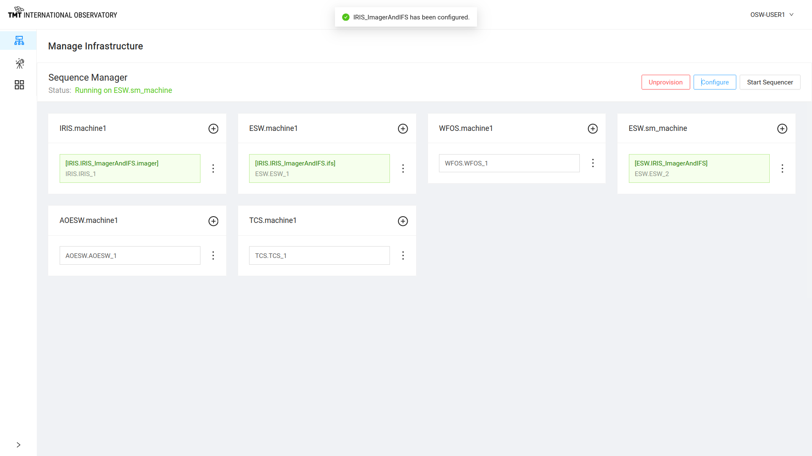

# Manage Infrastructure Page

This page shows status of Sequence Manager running on different machines like SM or agent. 
It displays information that Sequence Manager is running on ESW machine.
It shows in blocks, agents on every machine that will host Sequence Components and Sequencers and HCD/Assembly components on respective subsystem machines.

To add a Sequence Component to an Agent box, click on + sign on that agent block.

## Provision

Provision button on this page when clicked on displays the below dialog box where the user can enter the number of Sequence Component per Agent to be spawned for that particular Agent.

While provisioning, the API shuts down currently running Sequence Components before spawning new one. 

@@@ note

To know more about Provision functionality @extref[Visit Here](esw:technical/sequence-manager-tech.html#provision-sequence-components)

@@@

Once provision happens successfully, message is displayed or else error is displayed on the screen. 

## Unprovision

Once the agents are provisioned with Sequence Components, label on provision button changes to 'Unprovision'. 

Unprovision can also be done after 'Configure'

Click on Unprovision button to stop all Sequence Components. 

Unprovision happens successfully and all Sequence Components are shutdown. 

## Start Sequencer

When Provision call is completed, Start Sequencer button is enabled.

Click on Start Sequencer Button to see the below dialog box.

Select a subsystem and Obs-Mode to start the Sequencer. 

After selecting Subsystem and Obs-Mode, Sequencer will be started.

Click : on the Agent card with the started Sequencer to see the options available 

1. Stop Sequencer
2. Reload Script
3. Shutdown Sequencer

### Stop Sequencer

Click on Stop Sequencer to stop that particular Sequence Component. 

### Reload Script

Click on Reload Script to load Script for the Sequence Component. 

### Shutdown Sequencer

Click on Shutdown Component and a confirmation dialog box comes up. 

## Configure

When provision call is completed successfully, Configure button is enabled in Manage Infrastructure and @ref[Manage Observation](ManageObservation.md) page. 

On clicking the Configure button, list of the Observation Mode are displayed. User can select one of them. 

@@@ note

To know more about Configure Functionality @extref[visit here](esw:technical/sequence-manager-tech.html#configuring-sequencers-for-an-observing-mode)

@@@

The below figure shows that the Sequence Components were configured successfully. 

Configure can also be done from @ref[Manage Observation Page](ManageObservation.md)

