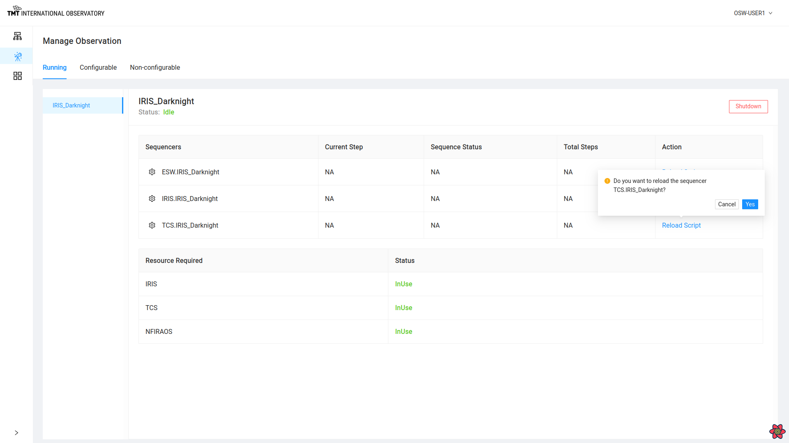

# Manage and Monitor Observation Page

The Manage Observation Page provides a way for the user to understand how the OCS is configured and
what is possible based on what is already configured. It is also allows the high-level monitoring of executing
Sequences and the ability to drill down into the Sequences on different Sequencers, and even modify Sequences.

The Manage Observation Page shows the following three tabs: `Running`, `Configurable`, and `Non-configurable`.  Each tab
is described below.

## The Running Tab

This page is useful for seeing a high-level view of all the obsModes currently configured.
On the left is a list of all the obsModes that are currently configured. In this case, only the IRIS_Darknight
obsMode is configured.

By selecting an obsMode on the left, the right-hand side shows of the tab displays the list of Sequencers that are currently part of the
obsMode, whether they are currently executing a Sequence, and their status.

At the bottom, the tab also shows information about the resources in use by the obsMode.

There are many things that can be done from this page.  Clicking on the gear next to name of a Sequencer
redirects to the @ref[Manage Sequencer Page](ManageSequencer.md) for the selected Sequencer.  This is covered below.

### Shutdown Sequencers

Clicking on the Shutdown button in the top right corner leads to the shutting down of all the Sequencers listed below for the obsMode.

### Reload Script

Sometimes, it is necessary or desirable to reload the Script in a specific Sequencer.
Clicking on `Reload Script` for a Sequencer helps in reloading the specific Script for that Sequencer.
This action can even be done when a Sequence is executing, so it is protected by a popup warning box that requires a confirmation.
If the Script is reloaded, the Sequencer is destroyed and recreated with the correct Script. This destroys any Sequencer state.
This is a low-level engineering command that is helpful if a Script has somehow become unresponsive.

Once a positive confirmation is given, it will reload the Script by stopping and restarting the Sequencer.

@@@ note
When a Script is reloaded, all internal Sequencer state information is gone. If a Sequence had been loaded in the Sequencer
prior to the restart, it will need to be reloaded or resent. If the Sequence is partially executed, knowledge of partial
execution is gone and the Sequence will need to be reloaded.
@@@

## Tracking A Sequence

The Running Tab of this page is also used to track the high-level progress of a Sequence during execution.
Each Sequencer row displays the current status of the running Sequence in the Sequencer along with the total number
of Steps in the Sequence and the name of the currently executing Step.

For example: When a Sequence is paused the status of that Sequencer will show in the Manage Observation Page as paused.

Similarly, the Sequencer Status values will show one of the following possible status values:

* Loaded - a Sequence has been loaded in the Sequencer, but is not yet running
* Idle/Online - a Sequence has finished executing
* In Progress - a Sequence is executing and a Step is executing
* Offline - a Sequencer is offline
* Killed

@@@ note

To read more about the above steps in the Sequencer Lifecycle @extref[Click here](esw:////technical/sequencer-tech.html#sequencer-lifecycle)

@@@

At the end of Sequence, the status will show 'All Steps Completed' or the number of Steps completed for each Sequencer.

To know more about Sequence completion read @extref[here](esw:////technical/sequencer-tech.html#completion-of-a-sequence)

There are more details that can be monitored for an executing Sequence. This is described in the Manage Sequencer Page @ref[here](./ManageSequencer.md)

## The Configurable Tab

The Running Tab is obviously the most important and useful, but the Configurable Tab is useful for knowing what is possible.
This tab shows a list of obsModes that are available for configuring. The list of obsModes shows only the obsModes that
are possible with the resources that are not already in use by the obsModes shown in the Running Tab. The bottom of the tab
shows the resources that the obsMode will use if configured.

As shown below, the WFOS_Calib calibration obsMode is configurable since it only uses the WFOS resource.

.

Clicking on Configure button in this Tab serves same purpose of @ref[Configure Button](./ManageInfrastructure.md#configure) on the Manage Infrastructure Page.

Once selected, the WFOS_Calib obsMode moves from the Configurable Tab to the Running Tab.

## The Non-Configurable Tab

The last tab is the Non-Configurable Tab. This tab shows the list of obsModes that can not be configured based on what is currently running.
This list will eventually include all the instrument and engineering obsModes and may be quite long.  It is true that only a few
obsModes can execute Sequences concurrently based on resources.

Once an obsMode is selected, the right-hand side displays information regarding why the selected obsMode is not available.
There are currently two reasons: lack of available Sequence Components, or lack of availability of resources. The former
can be fixed by provisioning more Sequence Components, the latter requires shutting down a currently configured obsMode to
free resources.
