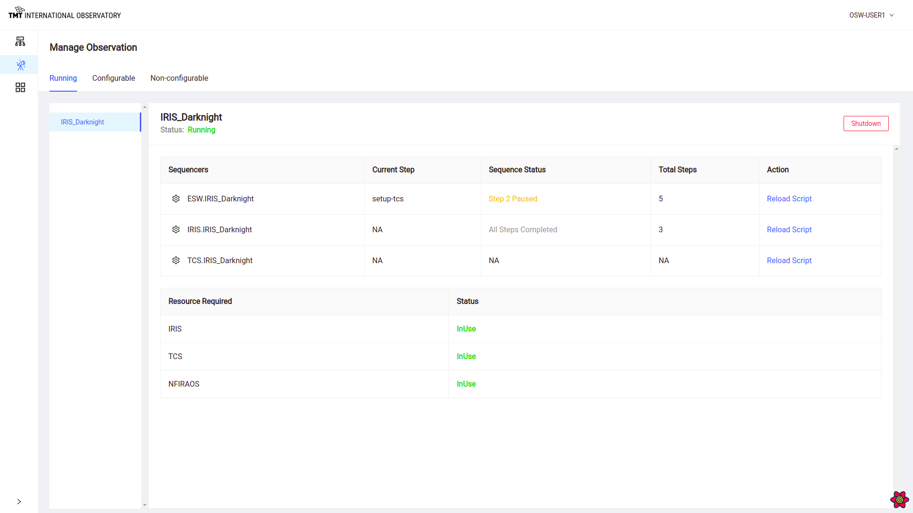

# Manage Observation Page

After Configuration is successful the Manage Observation shows the following three tabs.

## Running  

This tab shows the list of Sequencers that are currently running and their status.

It also shows information about resources in use.  

Clicking on gear next to name of sequencers redirects to @ref[Manage Sequencer Page](ManageSequencer.md)

### Shutdown Sequencer

Clicking on Shutdown button on top right corner leads to shutdown of all sequencers listed below.

### Reload Script

During execution of sequence, Script can be reloaded.

Click on Reload Script against each Sequencers helps in reloading specific script for that sequencer.

On clicking on Reload Script against each sequence, it will ask for a confirmation before proceeding.

 Once confirmation is given then it will reload the script by stopping and restarting the sequencer.

## Configurable

This tab shows list of resources that are available for configuring.

.

Clicking on Configure button in this Tab serves same purpose of @ref[Configure Button in Manage Infrastructure Page](./ManageInfrastructure.md#configure).

## Non-Configurable

This tab shows list of resources that are not available for configuring and are in use.

It also display information regarding unavailable sequence components.

## Tracking Sequence

This page will also be used to track the sequence while execution. It will display the current status of the running sequences against each sequencer.

For example : When a sequence is paused the status of that sequence will show in the Manage Observation page for that sequencer as paused.

Similarly all the Sequencers will show different status like

* Loaded
* Idle/Online
* In Progress
* Offline
* Killed

@@@ note

To read more about the above steps in Sequencer Lifecycle @extref[Click here](esw:////technical/sequencer-tech.html#sequencer-lifecycle)

@@@

At the end of sequence, the status will show 'All Steps Completed' or the number of steps completed for each sequencer.

To know more about Sequence Completion read @extref[here](esw:////technical/sequencer-tech.html#completion-of-a-sequence)

Read about the Manage Sequencer @ref[here](./ManageSequencer.md)
