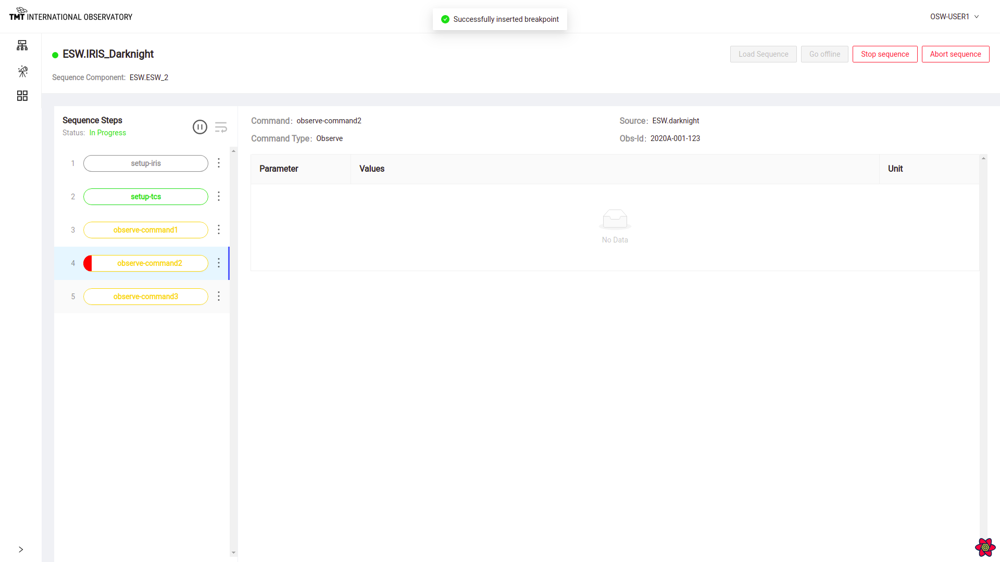
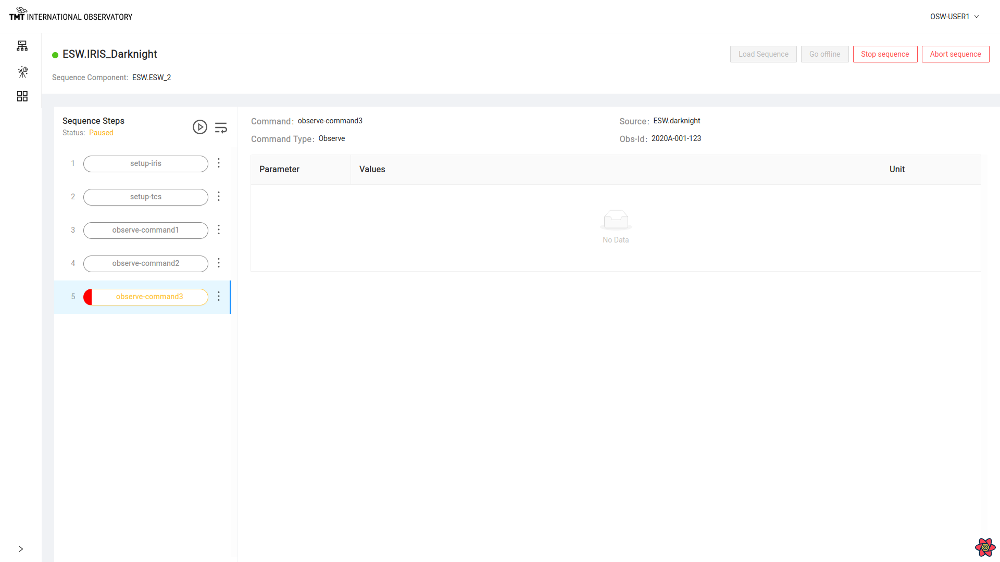
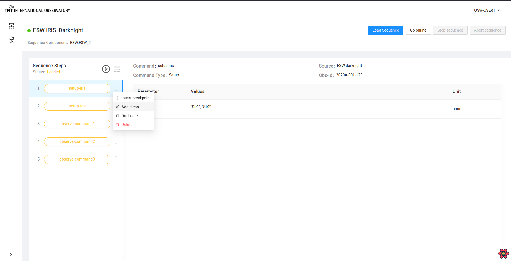
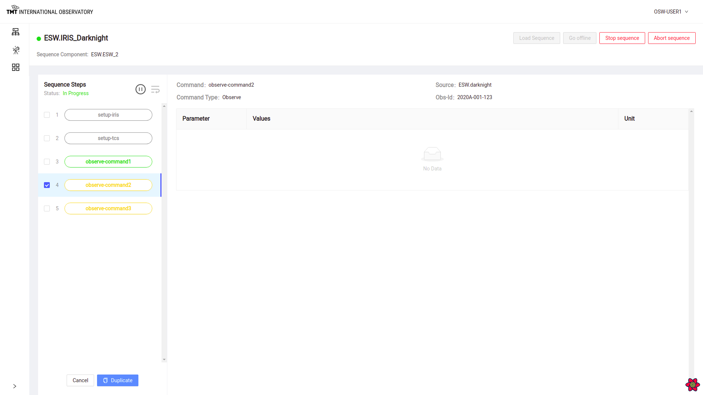
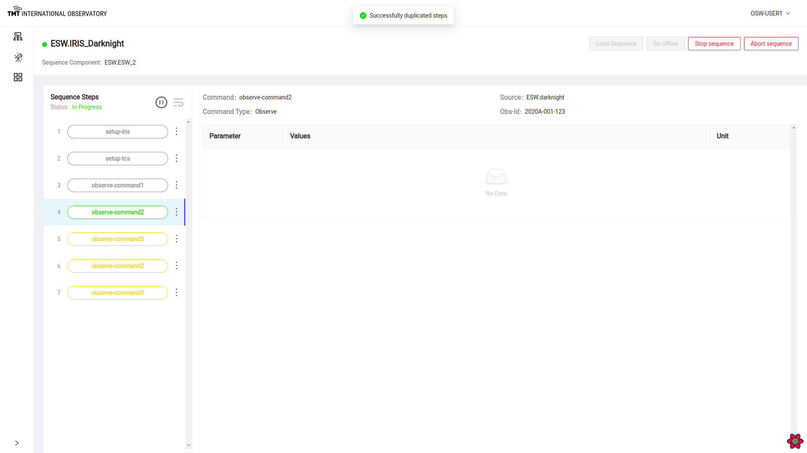
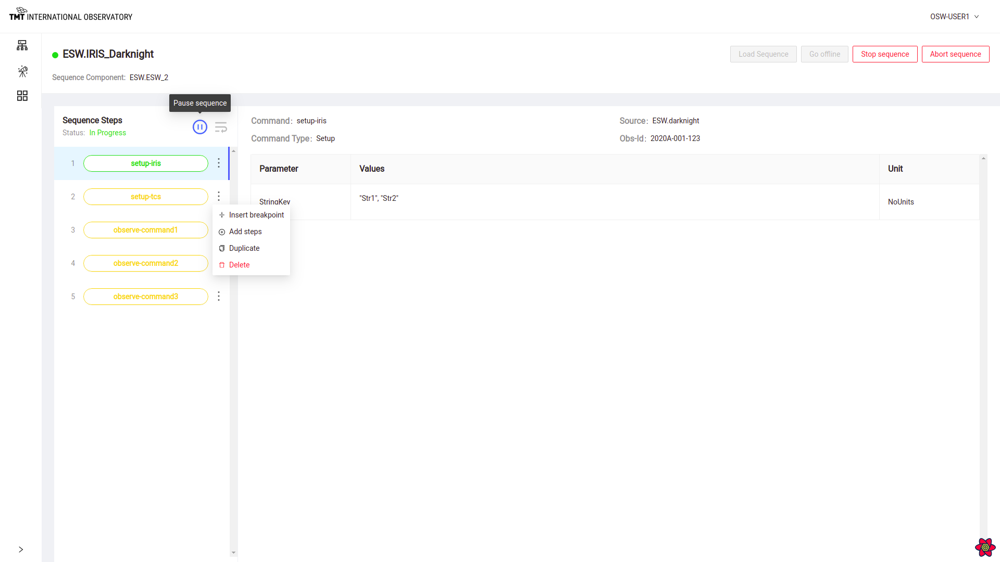
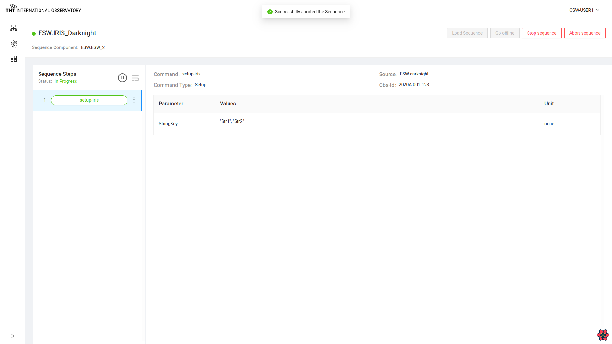

# Manage Sequencer Page

The Manage Sequencer Page is possibly the most useful *and fun* to use in the OCS-ENG-UI. Every Sequencer that is configured has
a Manage Sequencer Page that is accessed by clicking on the gear icon for the Sequencer in the top-level Manager Observation Page.
While the Manage Observation Page gives a high-level view of all the Sequencers of an obsMode including information about an executing Sequence,
the Manage Sequencer Page goes one step deeper and displays the details of the loaded Sequence, its Steps, and shows the progress of the
Sequence as it is executed by the Script.

A Manage Sequencer Page Sequence monitoring functionalities including:

* Inserting and Removing Breakpoints and Single-Stepping a Sequence
* Display the parameter values for each Step in the Sequence as it is executing
* Editing a Sequence including adding, duplicating, and deleting Steps in a Sequence

The page also allows low-level control of a single Sequencer.  Some of these commands are useful for diagnostics and
testing.

* Loading a Sequence
* Starting loaded Sequence
* Stopping  loaded Sequence
* Pause and Resume an executing Sequence
* Aborting and stopping a running Sequence

## Sequence Monitoring Overview
When a Sequence is loaded, the left-hand side of the Sequencer's page shows the Steps that are part of the loaded
Sequence. When no Sequence is loaded, the page is empty as shown below.

Once a Sequence is loaded, the left-hand side shows the Steps of the Sequence as shown in the following screenshot of
the IRIS Sequencer executing the IRIS.Darknight script.  There are 3 steps and all three have different colors.
A **yellow** Step means the Step has not yet been executed. The green
Step indicates the currently executing Step. The first Step is **black** meaning it has already executed.

Note also that the second step is shown inside a blue box. The blue indicates the Step is *selected*. The parameters and
values of the selected Step are shown on the right-hand side.  In this screenshot, the selected Step is also the
executing Step, but that is not necessary; any Step can be selected and its values displayed.

Note also that the normal behavior of this view is that the selected Step automatically tracks the executing Step. As the
Sequence executes, the selected Step also moves, so it always shows the executing Step's parameters and values. If you
select a different step, the automatic behavior is stopped until the executing Step is re-selected. Once the executing
Step is re-selected, the automatic behavior restarts.

### Loading a Sequence
In most cases, the Sequence is sent by another application (such as future SOSS tools or esw-shell) or submitted by another Sequencer as when the ESW
Sequencer sends a Sequence to the IRIS or TCS Sequencer. But sometimes it is helpful to load a Sequence
directly into a Sequencer for testing.

**Rajalakshmi, please insert an example of a correctly formated JSON Sequence HERE and add some text**

To load a Sequence from a file, click on the Load Sequence button which will open up a dialog box to select a Sequence in JSON format (.json) from the local disk.

Once the Sequence is loaded, the Status message below 'Sequence Steps' changes to 'Loaded' and the Go Offline button is enabled.

It shows list of steps in Orange color, indicating they are not yet executed. The name of the Step is inside the Step on the left.
Selecting a Step shows the Step's parameters, values, and units.

### Starting a Sequence
Sequences can be started in two ways. A Sequence sent using the Command Service `submit` causes the Sequence to begin executing immediately just like a command
sent to an Assembly.

If the Sequence is sent using load, it is ready for execution, but execution does not start until the Sequencer is commanded to start executing.
The `Play` button will also execute a loaded Sequence.

Click on the Play button next to 'Sequence Steps' to start a Sequence (the circle with the triangle like your music player).

Once a Sequence is started, the first Step in the Sequence of steps is shown in the green color indicating it is executing.

Once started, the Stop Sequence and Abort Sequence Button are enabled and the Load Sequence and Go Offline button are disabled.

## Sequence Step Features
There are a few actions available on a specific Step in a loaded Sequence in a Sequencer.
Select the vertical ellipsis **&#8942;** icon on any of the Steps to view the actions for the Step.

The available actions are:

* Insert a Breakpoint
* Add Steps
* Duplicate Steps
* Delete Steps

### Insert and Remove Breakpoint
During the execution of a Sequence or during an observation, it is sometimes needed to stop the Sequence before or after a specific Step.
One can always wait and pause the Sequence, but setting a breakpoint is more convenient. The breakpoint can be set between Steps, and the Sequence will stop
when it reaches the breakpoint.

Click on the vertical ellipsis **&#8942;** for the Step where the breakpoint needs to be inserted. Select 'Insert Breakpoint' Option.

Once the breakpoint is inserted on the Step, the Sequence will pause at that Step. Note that breakpoints can only be set on Steps that are not yet executed (i.e. yellow)!

Sequence pauses at the step where breakpoint was inserted.

To remove a previously inserted breakpoint, go to the Step where breakpoint was inserted and click on the vertical ellipsis **&#8942;** and select 'Remove Breakpoint' .

If the Sequence is paused, once the breakpoint is removed, the Sequence will resume execution.  If the Sequence has not yet reached the breakpoint, it is just removed.

### Step-Through
Step-Through is a convenience for setting and removing breakpoints. Sometimes, it is desirable to execute a Sequence one step at a time.
Sometimes this is called single-stepping. Step-Through is a way to execute a Sequence one step at a time.

**Rajalasksmi -- add text and image here.

## Sequence Editing
Several Sequence editing functions are available from a Sequencer's Manage Sequence Page.  Of course, a Sequence must
be loaded for editing to be possible.

### Adding Steps

Once a Sequence is loaded, Steps can be added from a file. This is not too frequently used, but may sometimes be useful.
Select the vertical ellipsis **&#8942;** at the Step after which more Steps are to be added.

Once `Add Step` is clicked, it opens a file selection dialog box to select a file of Steps as a JSON formatted file (.json). After the file is read, the Steps are added to the Sequence as shown below.
This can only be done in areas of a Sequence that are not yet executed.

### Duplicate Steps
It is possible to select Steps and duplicate them, adding them to the end of the Sequence.

Click on the vertical ellipsis **&#8942;** at a Step to duplicate and then click on 'Duplicate' in the Step menu.
Select the checkboxes of the Steps to be duplicated. Multiple Steps can also be selecte. Select the Steps and click the Duplicate button at the bottom.

Note that it is possible to duplicate previously executed Steps.

If duplication is successful, an appropriate message will be displayed and the Steps will be appended to the end of the Sequence.

@@@ warning
It is possible to cause problems when editing Steps in a Sequence.  Make sure you know aht you are doing!
@@@

### Delete Step
Sequence Steps can be deleted one at a time. Only unexecuted Steps can be deleted.

To Delete a step, click on the vertical ellipsis **&#8942;** of that step and click on 'Delete'. A pop up box shows up warning of impending danger.
Now click on the 'Delete' button to confirm deletion of the Step or else select the 'Cancel' button to avoid deleting.

Once the Step is deleted, a message is displayed indicating a successful deletion.

## Sequence Management Functions
This page also offers several functions for managing the state and behavior of an individual Sequencer. The
Manage Observation Page has similar functions for the observaton, but this page controls an individual Sequencer.

The buttons dicussed here are in the upper right of the Manage Sequencer page.

### Go Offline, Go Online
The selected Sequencer can be told to go offline and online.

The Go Offline button is only enabled when the Sequencer is idle or all its Steps have been executed or it has not yet started executing.

Once this button is clicked, the Sequencer goes offline.

Once the Sequencer is offline, the 'Go offline' label is replaced by 'Go online' label on the button. Click on 'Go Online' button to make the Sequencer go online again.

To read about Go offline and Go Online functionality @extref[visit here](esw:////scripts/dsl/constructs/handlers.html#online-and-offline-handlers).

## Pause and Resume Sequence
The selected Sequencer can be paused and resumed independent of the rest of the observation. The pause is equivalent to setting a breakpoint on
the first step after the currently executing step.

When the Sequence is in progress, the `pause` button can be used to pause the Sequence at the current Step. Once the Sequence is paused,
a message will be displayed and the pause icon will change to the resume icon.

When the Sequence is paused, the resume button can be used to resume the Sequence from the paused Step.
Once resumed, the Sequence will start executing again and the pause icon will again be enabled.

## Stop Sequence
A single Sequencer can be sent the Stop command.

To stop a Sequence in progress, click on 'Stop Sequence' button. This causes the Stop command to be sent to the Sequencer
and the code will be executed in the Stop handler.

A confirmation dialog box pops up.

Click on the 'Confirm' button to stop the Sequencer.

To read about Stop Sequence functionality @extref[visit here](esw:////scripts/dsl/constructs//handlers.html#stop-handler).

## Abort Sequence
A single Sequencer can be sent the Abort command.

To immediately abort a Sequence click on the 'Abort' button. A warning pop-up is shown.

Then click on the 'Confirm' button on the pop-up box to abort successfully.

To read about Abort Sequence functionality @extref[visit here](esw:////scripts/dsl/constructs/handlers.html#abort-sequence-handler).
