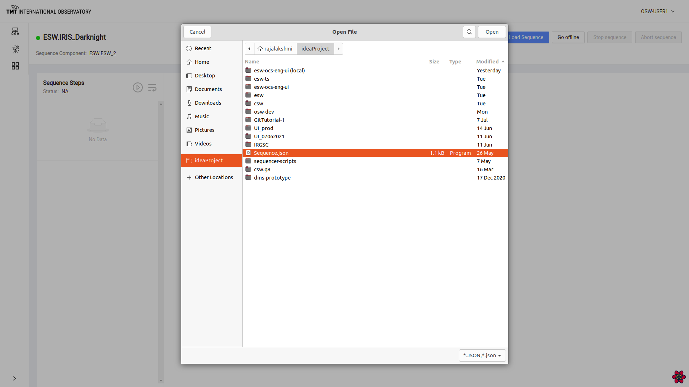

# Manage Sequencer Page

Manage Sequencer Page provides functionalities like

* Loading a Sequence 
* Starting loaded sequence
* Stopping  loaded sequence
* Pause and Resume loaded sequence
* Aborting running sequence
* Adding, Duplicating, Inserting/Removing Breakpoint and Deleting steps in a sequence
* Displays Parameter for each step in the execution

## Loading a Sequence   

Click on Load Sequence button which will open up a dialog box to load sequence in .json format from local disk. 

Once sequence is loaded, Status message below 'Sequence Steps' changes to 'Loaded' and Go Offline button is enabled.

It shows list of steps in Orange color. Clicking on each step shows the Command and its information like Source, Obs-id, Type and Parameters. 

### Go Offline, Go Online

Go offline button is enabled when sequence is loaded. 

Once this button is clicked, the sequencer goes offline. 

Once Sequencer is offline, 'Go offline' label is replaced by 'Go online' label on the button. Click on 'Go Online' button to go make sequencers go online again. 

To read about Go offline and Go Online functionality @extref[visit here](esw:////scripts/dsl/constructs/handlers.html#online-and-offline-handlers)

## Starting a sequence 

Click on play button next to 'Sequence Steps' to start a sequence.

Once a sequence is started, First step in the sequence of steps is visible in green color. 

Stop Sequence and Abort Sequence Button are enabled and Load Sequence and Go Offline button are disabled. 

Once Sequence is started, steps cannot be deleted and breakpoint cannot be inserted while sequence is in execution. Sequence has to be paused. 

## Pause and Resume Sequence

When Sequence is in progress, pause button can be used to pause the sequence at current step. Once sequence is paused, message will be displayed and pause icon will change to resume icon. 

When Sequence is paused, resume button can be used to resume the sequence from the paused step. Once resumed, sequence will start executing again and pause icon will again be enabled instead of resume icon. 

## Sequence Step Features

Select : icon on any of the steps to view actions on each step.

### Insert and Remove Breakpoint

Click on : for the step where breakpoint needs to be inserted.Select 'Insert Breakpoint' Option. 

Once breakpoint is inserted on the step, the sequence will pause at that step. 

Sequence pauses at the step where breakpoint was inserted. 

To Remove inserted breakpoint, go to the step where break point was inserted and click on : to select'Remove Breakpoint' .

Once breakpoint is removed, sequence will resume execution. 

### Add Step 

Once a sequence is loaded, steps can be added. Click on 'Add Step' at the step after which more steps have to be added.

Once 'Add Step' is clicked, it opens dialog box to upload more steps in the sequence as .json file. After file is uploaded, it adds steps to the sequence as shown below. 

### Duplicate Step

To duplicate multiple steps, Click on icon : on the step to duplicate and then click on 'Duplicate'. 

Multiple steps can also be selected to duplicate. Select the step and click on Duplicate button at the bottom. 

If duplication is successful, appropriate message will be displayed. 

### Delete Step

To Delete a step, click on : on that step and click on 'Delete'. Pop up box shows up. 
Now click on 'Delete' button to confirm deletion of the step or else press on 'Cancel' button to avoid deleting. 

Once the step is deleted, message is displayed.

## Stop Sequence

To stop a sequence in progress, click on 'Stop Sequence' button.

Confirmation Dialog box pops up . 

Click on 'Confirm' button to stop sequencer successfully. 

To read about Stop Sequence functionality @extref[visit here](esw:////scripts/dsl/constructs//handlers.html#stop-handler)

## Abort Sequence

To immediately abort a sequence click on 'Abort' Button. 

Click on 'Confirm' button on the pop-up box to abort successfully. 

To read about Abort Sequence functionality @extref[visit here](esw:////scripts/dsl/constructs/handlers.html#abort-sequence-handler)

