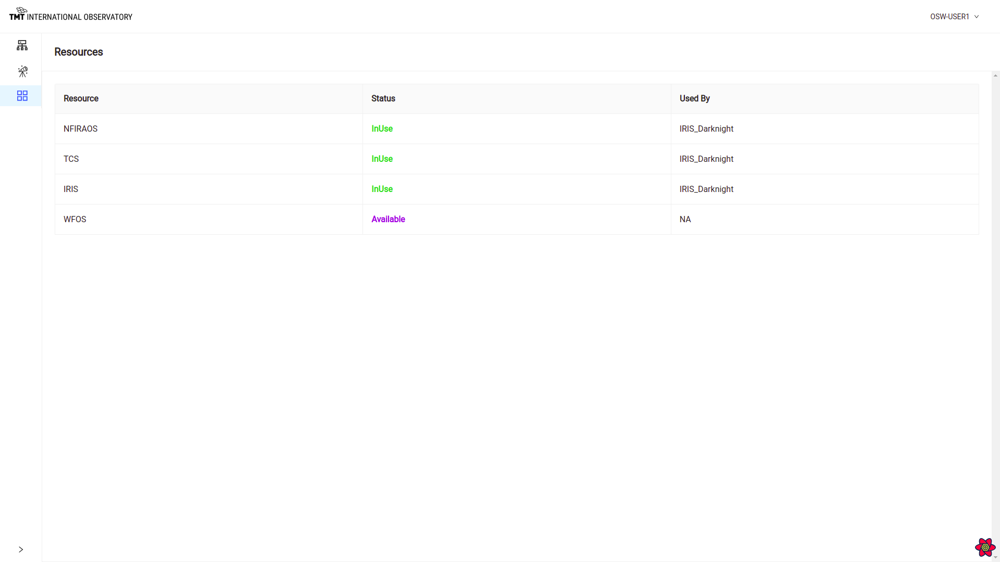

# The Resources Page

The `resources` of the observatory are the major pieces of the hardware and software system that are required by an observation in a specific obsMode.
Analysis during the ESW Phase 1 FDR led to a fairly short list of resources including the instruments, and the telescope with its subsystems.
On TMT, only one instrument at a time can observe the sky. Other instruments can take calibration exposures if they have
a self-contained calibration source.

The resources are configured for Sequence Manager as `subsystems` at this point in time. TCS, for instance, represents the telescope and all its subsystems.
The AO system including NFIRAOS, LGSF, AOESW, etc. is also a single resource. As discussed elsewhere, resources are used by Sequence Manager to determine which obsModes/Sequences can run
concurrently.

This page shows the list of all observatory resources along with its status as InUse or Available. If the resources is inuse the name of the obsMode using the resource is shown in the last column.

The screenshot below shows TCS, IRIS, and NFIRAOS are in use by the IRIS_Darknight obsMode, but the WFOS resources is available for use.

