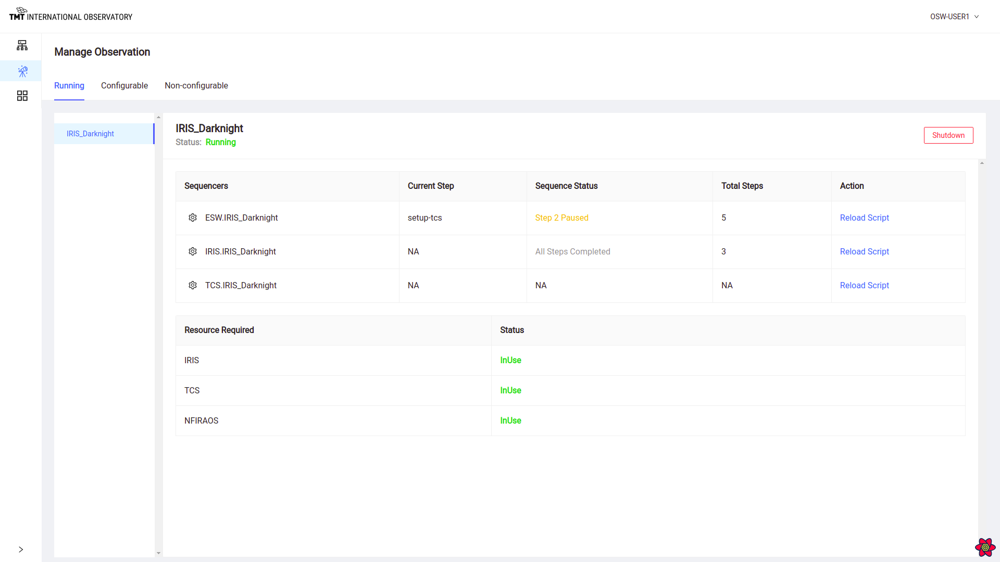

# OCS Engineering User Interface

TMT Observatory will use many web applications to observe and manage the observatory instruments and telescope systems. The TMT User interfaces can be grouped into two categories: observing user interfaces and engineering user interfaces. For the user interfaces, browser-based UI will provide an easy solution for remote access to systems and services.

The @link[esw-ocs-eng-ui](https://github.com/tmtsoftware/esw-ocs-eng-ui) provides a browser based User Interface to manage and track sequences in different observing mode. It also provides features like running parallel observation in different observation modes by checking for any resource conflict.

UI has been developed based on the below technologies:

- @link:[React](https://reactjs.org){ open=new }

- @link:[Ant Design](https://ant.design){ open=new }

- @link:[React Testing Library](https://testing-library.com/docs/react-testing-library/intro/){ open=new }

## User Manual Highlights

This manual aims at helping users understand how this User Interface works and its different features.

- @ref:[Getting started](Getting-started.md) which describes the basic setup required to run this user interface on a browser.
- @ref:[Process Flow](UI_processflow.md) describes the user process flow to work in the UI.
- @ref:[Login and Home Page](Login_HomePage.md) explains login procedure and functionalities on the home page.
- @ref:[Manage Infrastructure](ManageInfrastructure.md) shows the agents started on different machines and describes how to provision, configure sequence components.
- @ref:[Manage Observation](ManageObservation.md) is where the sequences can be tracked for different observing modes. It also shows in-use, configurable and non-configurable resources
- @ref:[Manage Sequencer](ManageSequencer.md) is where sequence can be loaded, started, paused and resumed. Once sequence is loaded, other important features get enabled as explained in this page of the manual.
- @ref:[Resources](Resources.md) shows the resources and sequence components in-use and unavailable.
